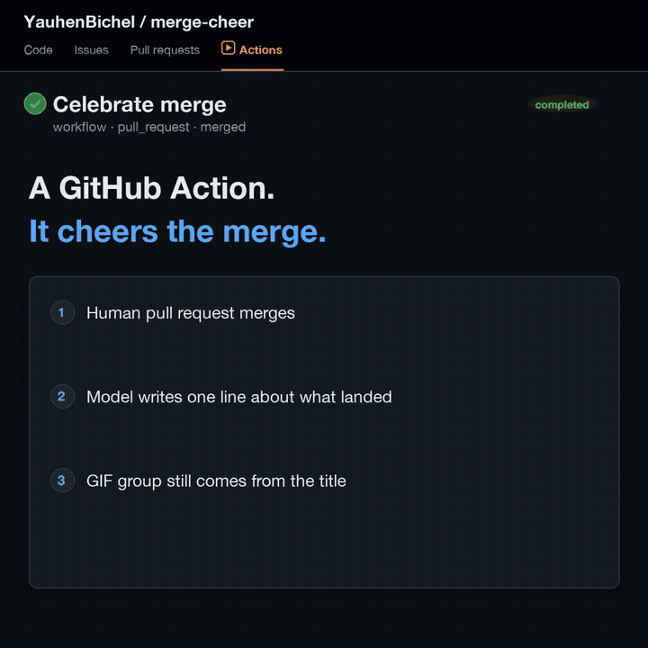

# Merge Cheer

Zero-config GitHub Action that comments a G-rated celebration GIF when a
pull request merges.

[](https://github.com/YauhenBichel/merge-cheer/actions/workflows/ci.yml)
[](https://github.com/YauhenBichel/merge-cheer/graphs/contributors)
[](LICENSE)
[](https://github.com/marketplace/actions/merge-cheer)
[](CODE_OF_CONDUCT.md)

Site: [yauhenbichel.github.io/merge-cheer](https://yauhenbichel.github.io/merge-cheer/) · Marketplace: [merge-cheer](https://github.com/marketplace/actions/merge-cheer)

GIF on merge, no Giphy key, no checkout of the pull request. The action
ships its own GIF groups and, by default, picks a **random theme**
(seeded by the pull request number so the same PR stays stable). Pin a
group with `topic` when you want one mood every time. Use `topic: title`
to pick from the title and body. A `no-cheer` / `skip-cheer` label (or
the same words in the title) skips the comment. On merge, the Action thanks
co-authors (`{authors}`, up to five, from `Co-authored-by` lines with a GitHub
noreply address) and reviewers. It will not post a second GIF for the
same moment. A changes-requested cheer does not block the merge cheer. Set an OpenAI-compatible `model` and `model-api-key` for
one G-rated line about what merged; generic thanks fall back to the
stdlib path.

[](https://yauhenbichel.github.io/merge-cheer/#demo)

Click for the 18-second walkthrough: what the Action comments, then four
shipped themes. GitHub cannot play video in a README, so the still opens
the [site demo](https://yauhenbichel.github.io/merge-cheer/#demo).

## Install

Pin `@v1.8.0` for an exact version, or `@v1` to follow the 1.x line.
The Action never checks out the pull request head.

### GitHub

1. Add [.github/workflows/celebrate-merge.yml](examples/celebrate-merge.yml)
   on the **default** branch (this file is enough).
2. `pull_request_target` + `pull-requests: write` is what lets a fork
   merge get a comment. Bots are skipped.
3. Merge a human pull request. github-actions comments one GIF.

```yaml
name: Celebrate merge
on:
  pull_request_target:
    types: [closed]
permissions:
  pull-requests: write
jobs:
  celebrate:
    if: github.event.pull_request.merged && github.event.pull_request.user.type != 'Bot'
    runs-on: ubuntu-latest
    steps:
      - uses: YauhenBichel/merge-cheer@v1.8.0
```

### Use your own GIFs and a note

On merge, pin your GIFs. `note` is an extra line after the thank-you
(Discord, docs) so locale and the model line still run. Copy
[examples/celebrate-custom.yml](examples/celebrate-custom.yml). https
URLs, G-rated, GIFs under 180 KB. The Action does not read pull
request head.

```yaml
- uses: YauhenBichel/merge-cheer@v1.8.0
  with:
    gifs-path: .github/merge-cheer
    note: "Come hang out on Discord — https://discord.gg/your-invite"
```

### Use a model

Zero-config stays `Merged — thank you @author`, or `Merged the readme
— thank you @author` when the title has a usable word. Add repository secret
`OPENAI_API_KEY` and copy
[examples/celebrate-openai.yml](examples/celebrate-openai.yml). Live
demo: [merge-cheer #53](https://github.com/YauhenBichel/merge-cheer/pull/53#issuecomment-5574024316)
—*Cheers to YauhenBichel for keeping model cheers that are about the
pull request!*

[](https://yauhenbichel.github.io/merge-cheer/#ai)

20 seconds. What the model writes, then the GIF.

This is the model path. Zero-config is still `Merged — thank you
@author`.

**What.** A human pull request merges. The model writes one short line
about what landed. The GIF group still comes from `topic`. Default
`auto` is a random theme. Set `topic: title` to use the title map.

**Why.** “Thanks” is empty. A line that names the work is the cheer
people actually read.

**How.** One secret. `model: gpt-4o-mini`. One call per merge. A 429
falls back to the stdlib line.

```yaml
- uses: YauhenBichel/merge-cheer@v1.8.0
  with:
    model: gpt-4o-mini
    model-api-key: ${{ secrets.OPENAI_API_KEY }}
```

`@v1.8.0` drops generic thanks. A 429 or a junk reply falls back to
the stdlib line — it is not retried. The Action still does not check
out the pull request head.

If the model cannot be reached — no reply within 20 seconds, a network
error, a strange reply, or a malformed key or base URL — the default
thank-you is posted anyway. The job logs `model skipped: <reason>` and a
warning, never the key.

### Use Hugging Face Inference

Add a repository secret `HF_TOKEN` with Inference Providers permission, then
copy [examples/celebrate-huggingface.yml](examples/celebrate-huggingface.yml)
onto the default branch. No OpenAI key is needed.

```yaml
- uses: YauhenBichel/merge-cheer@v1.8.0
  with:
    model: meta-llama/Llama-3.1-8B-Instruct:cheapest
    model-base-url: https://router.huggingface.co/v1
    model-api-key: ${{ secrets.HF_TOKEN }}
```

This uses an 8B chat model and the router's `:cheapest` provider policy.
See [Hugging Face Inference Providers](https://huggingface.co/docs/inference-providers/en/index)
for routing and billing. Available providers and prices can change.
One request writes the line; errors, rate limits, and unsafe or generic
replies still fall back to the default thank-you. The job never checks out
the pull request head.

### Use Google Gemini

Add a repository secret `GEMINI_API_KEY` from Google AI Studio, then copy
[examples/celebrate-gemini.yml](examples/celebrate-gemini.yml) onto the default
branch. If your key is already stored as `GOOGLE_API_KEY`, change only the
secret reference in `model-api-key` to `${{ secrets.GOOGLE_API_KEY }}`.

```yaml
- uses: YauhenBichel/merge-cheer@v1.8.0
  with:
    model: gemini-2.5-flash-lite
    model-base-url: https://generativelanguage.googleapis.com/v1beta/openai
    model-api-key: ${{ secrets.GEMINI_API_KEY }}
```

This uses Google's [OpenAI-compatible endpoint](https://ai.google.dev/gemini-api/docs/openai),
not an OpenAI key. The example uses 2.5 Flash-Lite because
[Gemini 2.0 Flash has been retired](https://ai.google.dev/gemini-api/docs/deprecations).
Errors, rate limits, and unsafe or generic replies fall back to the default
thank-you. The workflow never checks out the pull request head; tests need
no live API key.

### Use Groq

Add a repository secret `GROQ_API_KEY` from your Groq account, then copy
[examples/celebrate-groq.yml](examples/celebrate-groq.yml) onto the default
branch. No OpenAI key is needed.

```yaml
- uses: YauhenBichel/merge-cheer@v1.8.0
  with:
    model: openai/gpt-oss-20b
    model-base-url: https://api.groq.com/openai/v1
    model-api-key: ${{ secrets.GROQ_API_KEY }}
```

The example uses Groq's low-cost GPT OSS 20B chat model. See the
[Groq model page](https://console.groq.com/docs/models)
for current pricing and limits. Errors, rate limits, and unsafe or generic
replies fall back to the default thank-you. No pull request head checkout
or live API key is needed for the tests.

### Use Anthropic Claude

Add a repository secret `ANTHROPIC_API_KEY` using a key scoped to a single
Anthropic workspace, then copy
[examples/celebrate-anthropic.yml](examples/celebrate-anthropic.yml) onto the
default branch. No OpenAI key is needed.

```yaml
- uses: YauhenBichel/merge-cheer@v1.8.0
  with:
    model: claude-haiku-4-5-20251001
    model-base-url: https://api.anthropic.com/v1
    model-api-key: ${{ secrets.ANTHROPIC_API_KEY }}
```

This uses Anthropic's [OpenAI compatibility layer](https://platform.claude.com/docs/en/cli-sdks-libraries/libraries/openai-sdk),
which Anthropic positions for evaluation rather than most production use cases.
Keys with access to multiple workspaces require an `anthropic-workspace-id`
header that this Action does not expose; use a single-workspace key here.
The example pins Haiku 4.5. Errors, rate limits, and unsafe or malformed replies
fall back to the default thank-you. No pull request head checkout or live key
is needed for the tests.

### Keep credits low

The model writes only the thank-you line. The GIF group stays from
`topic` (`auto` is random, `title` is the map). One call per merge,
then skip if that pull request already has a cheer. Use `gpt-4o-mini`.
A bigger model does not help one sentence. Pin `message` when you do
not want a model call.

Also comment when a pull request **closes without a merge**, or when a
reviewer asks for **more work**. Tone stays kind. Copy
[examples/celebrate-more.yml](examples/celebrate-more.yml). Close uses
the `coffee` group. A changes request uses `yeah`. Add
[examples/celebrate-more-openai.yml](examples/celebrate-more-openai.yml)
when you want the model to write those lines too — the GIF group still
comes from `closed-topic` / `changes-topic`. The Action never
checks out the pull request head. The full case list is on the
[site](https://yauhenbichel.github.io/merge-cheer/#cases).

### GitLab

The Catalog row is not live. Copy the curl job.

1. Copy [examples/gitlab-ci.yml](examples/gitlab-ci.yml) onto the default
   branch.
2. Add a project access token `GITLAB_TOKEN` with `api` scope.
   `CI_JOB_TOKEN` cannot post merge-request notes.
3. Merge to the default branch. The job finds that MR and comments the
   GIF. A job that can see a closed or change-requested MR uses those
   moments instead.

```yaml
celebrate:
  image: python:3.13-alpine
  variables:
    TOPIC: auto
    ACTION_REF: v1.8.0
    ACTION_REPO: YauhenBichel/merge-cheer
    ACTION_SHA256: ""   # from the release notes; pins the script
  script:
    - apk add --no-cache curl
    - curl -fsSL "https://raw.githubusercontent.com/YauhenBichel/merge-cheer/${ACTION_REF}/src/celebrate.py" -o /tmp/celebrate.py
    - if [ -n "$ACTION_SHA256" ]; then echo "$ACTION_SHA256  /tmp/celebrate.py" | sha256sum -c -; fi
    - python3 /tmp/celebrate.py
```

The script runs with your token. Set `ACTION_SHA256` to the hash in the
release notes, and the job refuses any other file.

How to publish a Catalog row later: [MARKETPLACES.md](MARKETPLACES.md).

### Bitbucket

The Docker Hub pipe is not public. Copy the curl job.

1. Copy [examples/bitbucket-pipelines.yml](examples/bitbucket-pipelines.yml)
   onto `main` (or `master`).
2. Add a secured repository variable `BITBUCKET_ACCESS_TOKEN` with
   pullrequest write.
3. Merge a pull request into that branch. The step comments the GIF.
   A job that can see a declined or change-requested PR uses those
   moments instead.

```yaml
script:
  - export ACTION_REF=v1.8.0
  - export ACTION_REPO=YauhenBichel/merge-cheer
  - export TOPIC="${TOPIC:-auto}"
  - export ACTION_SHA256="${ACTION_SHA256:-}"   # from the release notes
  - curl -fsSL "https://raw.githubusercontent.com/YauhenBichel/merge-cheer/${ACTION_REF}/src/celebrate.py" -o celebrate.py
  - if [ -n "$ACTION_SHA256" ]; then echo "$ACTION_SHA256  celebrate.py" | sha256sum -c -; fi
  - python3 celebrate.py
```

How to publish a Hub image and Pipes row later: [MARKETPLACES.md](MARKETPLACES.md).

Pin a group:

```yaml
- uses: YauhenBichel/merge-cheer@v1.8.0
  with:
    topic: ship   # or party, comic, sunny, game, sticker, yeah
```

`topic` is `auto` when unset: a random shipped theme, then one GIF in
that group. Different PR numbers can land on different groups. Allowed
names: `auto`, `title`, `ship`, `fix`, `docs`, `tests`, `cleanup`,
`celebration`, `welcome`, `party`, `space`, `magic`, `coffee`, `robot`,
`comic`, `sunny`, `game`, `sticker`, `yeah`, `devops`, `sre`, `qa`,
`design`, `architecture`, `engineering`, `backend`, `frontend`, `java`,
`python`, `cpp`, `golang`. An unknown name falls back
to `celebration` and prints the list.

## Live demo

The still above opens the walkthrough. What / why / where / how:

**What.** Merge Cheer comments one G-rated GIF when a human pull request
merges. Bots are skipped. The Action does not check out the pull request.

**Why.** The merge is the moment people actually did the work. No Giphy
key. The Action ships its own loops, so it works on a new repository
with the default token.

**Where.** Code is this repository. The same video and a walkthrough live
on the site:
[yauhenbichel.github.io/merge-cheer](https://yauhenbichel.github.io/merge-cheer/#demo).
Real comments already landed on
[py-harness #350](https://github.com/YauhenBichel/py-harness/pull/350#issuecomment-5559092736)
and
[molecare-desktop #26](https://github.com/MoleCare/molecare-desktop/pull/26#issuecomment-5559101123).

**How.** Pin `@v1.8.0` on the default branch (see [Install](#install)).
Leave `topic` unset (or `topic: auto`) for a random theme, seeded by the
pull request number. Pin `topic: comic` when you want the same mood
every time.

The loops below are the files the Action posts (open a file on GitHub to
see it move).

| ship | fix | docs | tests |
| --- | --- | --- | --- |
|  |  |  |  |

| cleanup | celebration | welcome | party |
| --- | --- | --- | --- |
|  |  |  |  |

| space | magic | coffee | robot |
| --- | --- | --- | --- |
|  |  |  |  |

| comic | sunny | game | sticker | yeah |
| --- | --- | --- | --- | --- |
|  |  |  |  |  |

| devops | sre | qa | design |
| --- | --- | --- | --- |
|  |  |  |  |

| architecture | engineering | backend | frontend |
| --- | --- | --- | --- |
|  |  |  |  |

| java | python | cpp | golang |
| --- | --- | --- | --- |
|  |  |  |  |

This repository dogfoods
[.github/workflows/celebrate.yml](.github/workflows/celebrate.yml)
(`uses: ./`). Live comments already landed on
[merge-cheer #53](https://github.com/YauhenBichel/merge-cheer/pull/53#issuecomment-5574024316),
[py-harness #350](https://github.com/YauhenBichel/py-harness/pull/350#issuecomment-5559092736),
and
[molecare-desktop #26](https://github.com/MoleCare/molecare-desktop/pull/26#issuecomment-5559101123).

## Used by

8 public repositories in MoleCare and this account already run Merge
Cheer on the default branch.

**MoleCare:** [molecare-mcp](https://github.com/MoleCare/molecare-mcp),
[molecare-ml](https://github.com/MoleCare/molecare-ml),
[molecare-desktop](https://github.com/MoleCare/molecare-desktop),
[molecare-skin-llm](https://github.com/MoleCare/molecare-skin-llm),
[.github](https://github.com/MoleCare/.github).

**Also:** [py-harness](https://github.com/YauhenBichel/py-harness),
[python-vibe](https://github.com/YauhenBichel/python-vibe),
[readme-contributors](https://github.com/YauhenBichel/readme-contributors).

To be listed, merge a celebrate workflow that
`uses: YauhenBichel/merge-cheer@v1.8.0` on the default branch.

## Topics

Each group is a folder of GIFs (`gifs/<group>/`). The action picks one
file in the group (stable for a given pull request number).

| `topic` | Title contains (when `topic: title`) | Preview |
| --- | --- | --- |
| `ship` | `feat`, `add `, `added`, `new `, `launch`, `ship:` |  |
| `fix` | `fix`, `bug`, `hotfix`, `patch` |  |
| `docs` | `doc`, `readme` |  |
| `tests` | `test`, `ci`, `build:` |  |
| `cleanup` | `refactor`, `clean`, `typo`, `style`, `lint`, `format`, `chore:` |  |
| `celebration` | anything else |  |
| `welcome` | `welcome`, `good first`, first-time contributor |  |
| `party` | `party`, `congrats`, `woo`, `hooray`, `celebrate` |  |
| `space` | `cosmos`, `galaxy`, `orbit`, `planet` |  |
| `magic` | `magic`, `sparkle`, `wand`, `spell` |  |
| `coffee` | `coffee`, `latte`, `caffeine`, `espresso` |  |
| `robot` | `robot`, `android` |  |
| `comic` | `comic`, `kapow` |  |
| `sunny` | `sunny`, `sunshine`, `sunbeam` |  |
| `game` | `level-up`, `level up`, `combo`, `high score` |  |
| `sticker` | `sticker` |  |
| `yeah` | `yeah`, `let's go`, `fist pump` |  |
| `devops` | `devops`, `kubernetes`, `k8s`, `docker` |  |
| `sre` | `sre`, `on-call`, `slo` |  |
| `qa` | `qa`, `sdet`, `quality` |  |
| `design` | `design`, `figma`, `ux` |  |
| `architecture` | `architecture`, `adr` |  |
| `engineering` | `software engineering`, `swe` |  |
| `backend` | `backend`, `graphql` |  |
| `frontend` | `frontend`, `javascript`, `react` |  |
| `java` | `java:`, `jdk`, `jvm` |  |
| `python` | `python`, `django`, `flask` |  |
| `cpp` | `c++`, `cpp` |  |
| `golang` | `golang`, `gopher` |  |

`welcome` also wins on `topic: title` when GitHub marks the author
`FIRST_TIME_CONTRIBUTOR` or `FIRST_TIMER` and the title did not match
another group. It reuses the tests and celebration loops — no extra art.
The comment adds `First contribution — welcome.` for those authors.

Conventional title types (`fix`, `feat`, `docs`, `test`, `refactor`)
win before mood keywords, so `feat: add party mode` still ships.

Aliases: `launch` → `ship`, `nailed-it` → `fix`, `nice-work` → `docs`,
`ci` / `high-five` → `tests`, `refactor` → `cleanup`, `first` → `welcome`,
`congrats` / `woo` → `party`, `cosmos` / `galaxy` → `space`,
`sparkle` → `magic`, `latte` → `coffee`, `bot` → `robot`,
`kapow` → `comic`, `sunshine` → `sunny`, `level-up` / `combo` → `game`,
`stickers` → `sticker`, `lets-go` / `fist-pump` → `yeah`,
`k8s` / `docker` → `devops`, `on-call` → `sre`, `testing` / `sdet` → `qa`,
`ux` / `figma` → `design`, `arch` → `architecture`, `swe` → `engineering`,
`js` / `react` → `frontend`, `jdk` → `java`, `py` → `python`,
`c++` → `cpp`, `go` / `gopher` → `golang`.

`javascript` does not match `java`. Conventional `test` / `ci` still win
before `qa`. `feat: add python client` still ships.

## Inputs

| Input | Default | What it does |
| --- | --- | --- |
| `github-token` | `${{ github.token }}` | Posts the comment |
| `topic` | `auto` | Group name, `auto` for a random theme, or `title` to pick from the PR title and body |
| `giphy-api-key` | empty | Optional. When set, try a G-rated Giphy GIF first |
| `gifs` | empty | Optional https image URLs (comma or newline). Merge only. One is picked, seeded by the pull request number |
| `gifs-path` | empty | Optional folder on the default branch of `.gif` / `.webp` / `.png` files. Listed via the GitHub API |
| `note` | empty | Optional extra line after the thank-you (Discord, docs). G-rated. Does not replace `message` |
| `message` | `Merged — thank you @{author}.` | `{author}` becomes `@login` so GitHub notifies them; `{authors}` adds up to five human co-authors (GitHub noreply `Co-authored-by` lines) and reviewers, on merge only |
| `locale` | `en` | Default thank-you and first-timer language (`en`, `es`, `de`, `fr`, `pt`, `uk`, `it`, `be`, `ja`). Unknown codes fall back to English. A pinned `message` wins |
| `closed-topic` / `closed-message` | `coffee` / closed thanks | Used when a pull request closes without a merge |
| `changes-topic` / `changes-message` | `yeah` / more-work line | Used when a reviewer asks for more work |
| `model` | empty | Optional chat model for the thank-you line only. GIF group stays from `topic` (`auto` is random, `title` is the map) |
| `model-api-key` | empty | Optional OpenAI-compatible key. Unset keeps the stdlib path |
| `model-base-url` | empty | Optional OpenAI-compatible API root |
| `rating` | `g` | Giphy rating when a key is set |

```yaml
- uses: YauhenBichel/merge-cheer@v1.8.0
  with:
    topic: welcome
    giphy-api-key: ${{ secrets.GIPHY_API_KEY }}
    message: "Shipped. Thank you @{authors}."
    # model: gpt-4o-mini
    # model-api-key: ${{ secrets.OPENAI_API_KEY }}
```

## Why this instead of a random Giphy Action

Most merge-GIF actions need a Giphy key and post whatever the API
returns. Merge Cheer works on a new repository with zero secrets, and
the fallback is a set of owned looping GIFs — not a pixel parrot.

## Security

- The title is read from an environment variable, not interpolated into a shell.
- The action does not check out code.
- It only comments. It does not push, merge, or approve.

See [SECURITY.md](SECURITY.md).

## Contributing

See [CONTRIBUTING.md](CONTRIBUTING.md). Please follow the
[Code of Conduct](CODE_OF_CONDUCT.md).

A good first change is another GIF in an existing group folder, or a
title keyword for a group, plus a test. If
[`good first issue`](https://github.com/YauhenBichel/merge-cheer/labels/good%20first%20issue)
is empty, open an issue first — see [CONTRIBUTING.md](CONTRIBUTING.md).

```bash
python3 -m unittest discover -s tests -q
```

## Publish a release

Current release is `v1.8.0`. `@v1` now moves with each 1.x release, so
pinning it follows the line rather than freezing on the first tag. Listed on the [GitHub Marketplace](https://github.com/marketplace/actions/merge-cheer).
A reviewed Release is tests plus a human review — see [RELEASE.md](RELEASE.md).
Pushing a tag does not publish. Later releases update the existing listing.

The site is [yauhenbichel.github.io/merge-cheer](https://yauhenbichel.github.io/merge-cheer/).
The first Pages job 404s until you turn the site on in a browser:
**Settings → Pages → Build and deployment → Source → GitHub Actions**.
Then re-run the Pages workflow.

## Rebuild the GIFs

```bash
python3 -m pip install -r requirements-dev.txt
python3 scripts/make_gifs.py
```

Writes `gifs/<group>/<name>.gif`. Keep each file under 180 KB. A group
may hold several files; `alt.gif` is the same still with the pulse
inverted. Mood groups (`party`, `space`, `magic`, `coffee`, `robot`, `comic`,
`sunny`, `game`, `sticker`, `yeah`) each ship two original stills.

## License

[MIT](LICENSE). The GIFs are original stills animated for this Action.
See [NOTICE](NOTICE).

## Contributors

Thank you to everyone who has helped.

<!-- readme: contributors,bots/- -start -->
<p align="center">
  <a href="https://github.com/YauhenBichel" title="Yauhen Bichel" aria-label="Yauhen Bichel"></a>
  <a href="https://github.com/Gambit-Checkmate" title="Checkmate" aria-label="Checkmate"></a>
  <a href="https://github.com/HeaTTap" title="HeaTTap" aria-label="HeaTTap"></a>
  <a href="https://github.com/Jo-shreer" title="Jyoti Gupta" aria-label="Jyoti Gupta"></a>
  <a href="https://github.com/Som0111" title="Soumya Padhi" aria-label="Soumya Padhi"></a>
</p>
<p align="center"><em>The contributors wall proudly displays the names of five dedicated individuals.</em></p>
<!-- readme: contributors,bots/- -end -->

Filled from the GitHub contributors API (bots omitted). Live demo: [readme-contributors](https://github.com/YauhenBichel/readme-contributors#live-demo).
